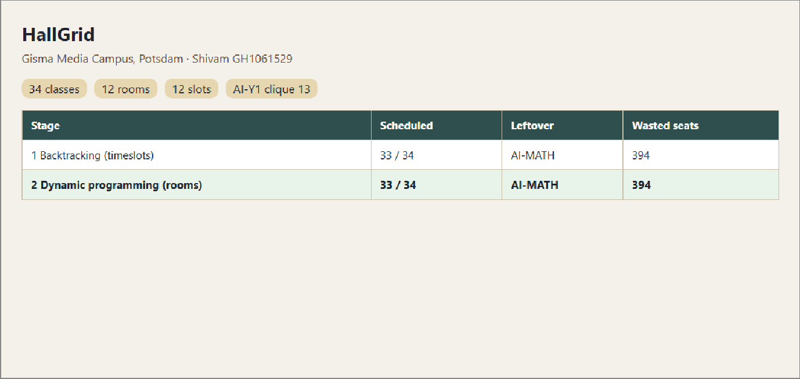
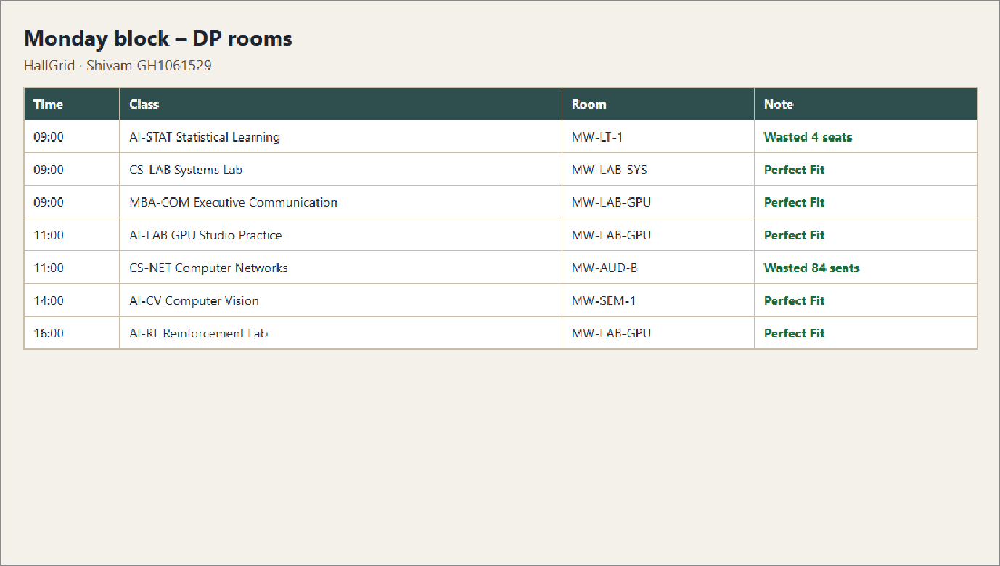
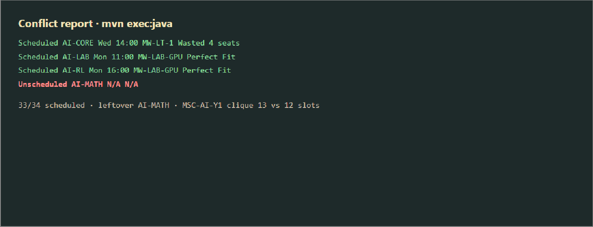
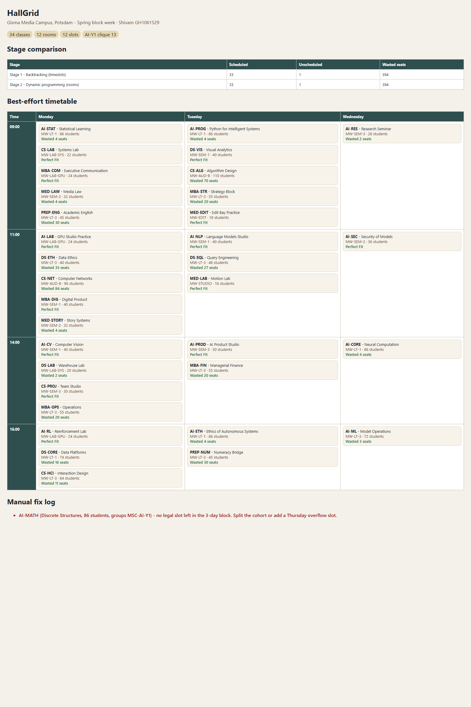
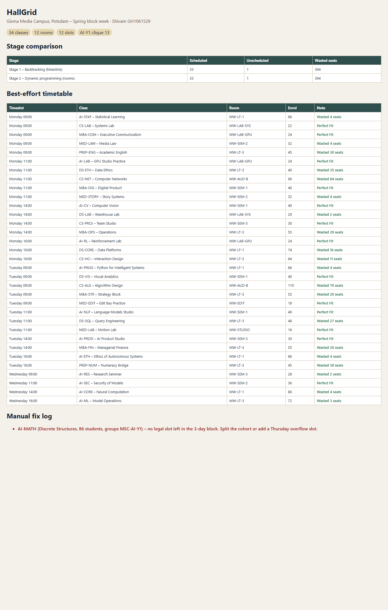

# HallGrid

The **two strongest stages only**: backtracking for timeslots, then dynamic programming for rooms.

Author: **Shivam · GH1061529**  
Module: M603 Advanced Algorithms

Greedy first-fit and graph colouring were tried while designing the engine. They seated 33/34 classes but wasted 3,000+ seats. Those stages are **not** in this submission. The pair below is the one that actually earns the grid: **33/34 scheduled, 394 wasted seats**.

Year 1 MSc AI needs 13 modules in a 12-slot block, so one leftover is structural.

## Run

```powershell
cd "C:\Users\shiva\OneDrive\Desktop\M603 Assignment\hallgrid"
& "$env:TEMP\apache-maven-3.9.6\bin\mvn.cmd" -q compile exec:java
```

Then open `output/schedule.html`.

## VS Code

1. Install **Extension Pack for Java** (Microsoft).
2. File → Open Folder → this `hallgrid` folder (the one with `pom.xml`).
3. Open `src/main/java/com/shivampoonia/hallgrid/HallGridApp.java` and click **Run**.
4. Or paste the PowerShell command above in the VS Code terminal.

## Photos

These match the figures in the Canvas report (the PDF itself is not in this repo).

Figure 1 – stage results (backtracking + DP):



Figure 2 – Monday block after DP room fit:



Figure 3 – conflict report (leftover AI-MATH):



Figure 4 – full best-effort timetable (Mon–Wed grid):



List view of the same timetable:



## Data (`/data/constraints.json`)

classes, rooms, studentGroups, timeslots (Mon–Wed block).  
`AI-STAT` is shared by MSC-AI-Y1 and MSC-DS-Y1.

## Code map

| Stage | File |
|-------|------|
| 1 Backtracking (timeslots) | `src/main/java/com/shivampoonia/hallgrid/backtrack/Backtracker.java` |
| 2 Dynamic programming (rooms) | `.../optimizer/RoomOptimizer.java` |
| main | `.../HallGridApp.java` |

## Architect’s defence

### Stage 1 – Backtracking

Assign clash-free timeslots (shared professor or student group ⇒ different slot). MRV, coverage bound, skip (clique larger than 12), 4 s budget. Each finished map is scored by Stage 2.

### Stage 2 – Dynamic programming

For each timeslot, `dp[i][mask]` seats remaining classes into free rooms. Skip cost 100000 beats any waste, so coverage comes first, then leftover seats. O(k·R·2^R) per slot; here R = 12.

## Conflict report

```
Scheduled AI-CORE Wed 14:00 MW-LT-1 Wasted 4 seats
Scheduled AI-LAB Mon 11:00 MW-LAB-GPU Perfect Fit
Unscheduled AI-MATH N/A N/A
```

## Results

| Stage | Scheduled | Leftover | Wasted seats |
|-------|-----------|----------|--------------|
| 1 Backtracking + 2 DP rooms | 33/34 | AI-MATH | **394** |

## Manual fix log

Park AI-MATH on a Thursday overflow, or drop one AI seminar off-block so the clique fits in 12 slots.
